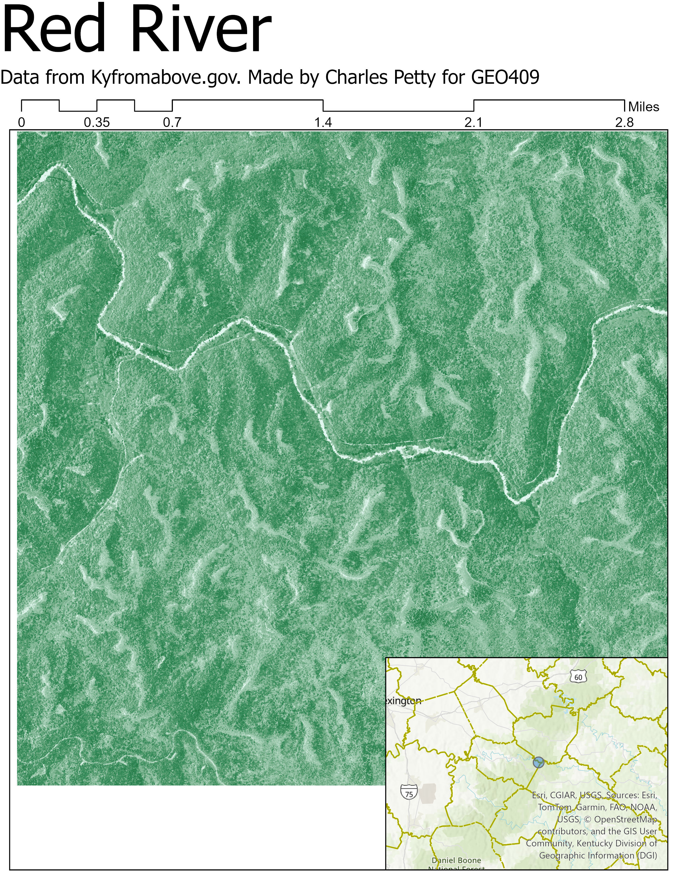

# Red River
## Tributary in Kentucky(97.2 mi)

The area shown is a part of Red river in east-central Kentucky

     
*Red River Area*

[Red River PDF](Redriver1.pdf)     

The data to create the layout is from Kyfromabove and the data was manipualted in Blender and ARCGis Pro. This was created by Charles Petty for GEO409